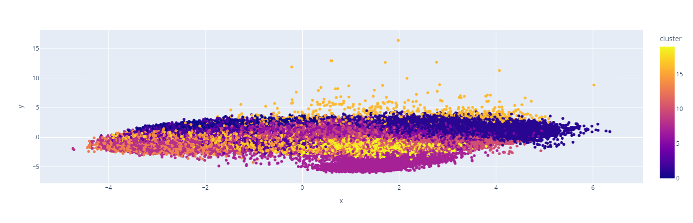
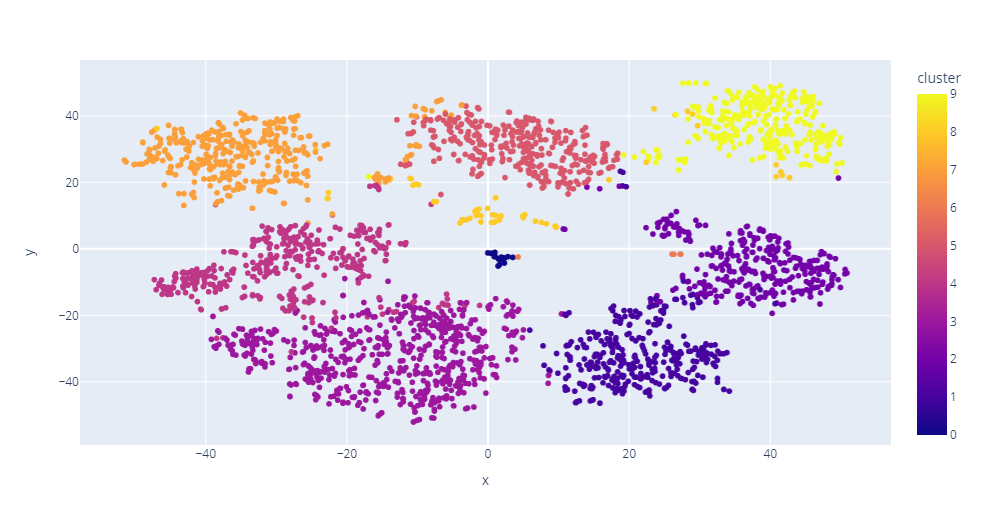
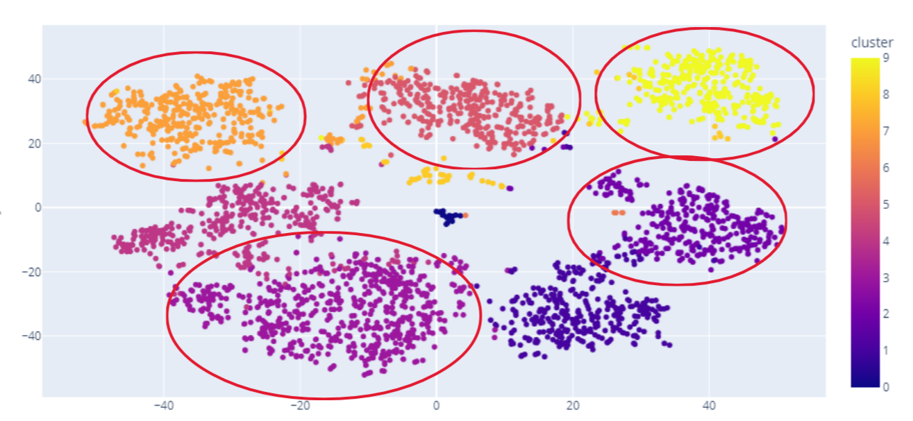

# Music Recommendation System with Clustering and Classification


This project involves building a music recommendation system using advanced machine learning techniques, including clustering and classification. The analysis leverages data preprocessing, dimensionality reduction, and model training on genre and song data to create insightful visualizations and accurate predictions.

## Project Overview

This project aims to:

- Analyze music genre data and identify patterns using clustering.
- Employ Principal Component Analysis (PCA) and t-SNE for dimensionality reduction and visual exploration.
- Build a classification model using a Random Forest Classifier with Recursive Feature Elimination (RFE) for feature selection.

## Project Workflow

1. **Data Preprocessing**: Initial data loading, cleaning, and preparation for feature extraction.
2. **Clustering Analysis**:
   - Applied KMeans clustering on genre data to group similar music features.
   - Visualized clusters using t-SNE for a clear understanding of genre distribution.
3. **Dimensionality Reduction**:
   - Reduced the song data dimensions using PCA for effective 2D visualization.
4. **Classification Model**:
   - Developed a classification pipeline with RFE for feature selection and Random Forest for prediction.

## Visual Analysis

### Clustering Visualization

The clustering analysis performed on the music genre data displays distinct group separations, helping identify music patterns:



### PCA Analysis Visualization

PCA was used to reduce the dimensionality of the song data, allowing for 2D visualization of song clusters:



### Post-Classification Visualization

The model's performance and output after classification analysis are represented here:



## Model Performance

The classification model's accuracy, using Random Forest and RFE for feature selection, is as follows:

```plaintext
Accuracy of the Random Forest model with RFE feature selection: 0.86
```
